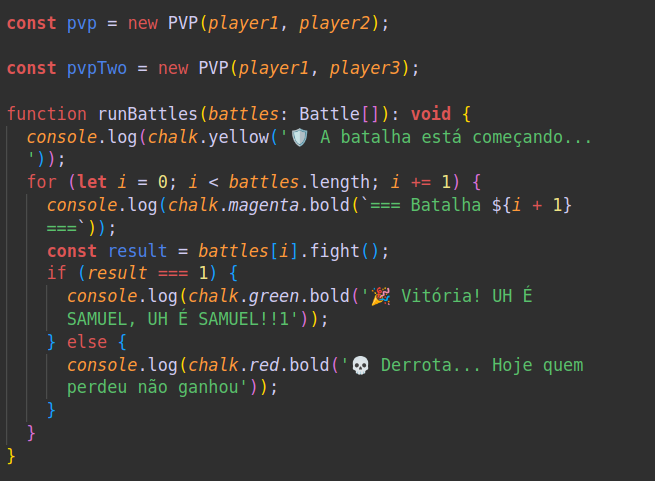

#  Project Trybers and dragons 

## 🌠[](https://github.com/SamuelRocha91/trybeAndDragons/blob/main/README.md) [](https://github.com/SamuelRocha91/trybeAndDragons/blob/main/README_es.md) [](https://github.com/SamuelRocha91/trybeAndDragons/blob/main/README_en.md) [](https://github.com/SamuelRocha91/trybeAndDragons/blob/main/README_ru.md) [](https://github.com/SamuelRocha91/trybeAndDragons/blob/main/README_ch.md) [](https://github.com/SamuelRocha91/trybeAndDragons/blob/main/README_ar.md)




<details>
  <summary><h2>📝 Descrição</h2></summary>

  **Trybers and Dragons** é uma aplicação de RPG onde os usuários podem criar personagens com diversas raças e arquétipos, e gerar confrontos emocionantes entre personagens, seja em modos Player vs. Environment (PvE) ou Player vs. Player (PvP). Através da manipulação do arquivo `index.ts` e da função `runBattles`, os jogadores podem criar e desafiar outros personagens em combates épicos.

</details>

<details>
  <summary><h2>✨ Características</h2></summary>

  - **Criação de Personagens**: Escolha entre várias raças (como Elfos, Humanos, etc.) e arquétipos para construir seu personagem único.
  - **Modos de Conflito**: Conduza batalhas PvE contra criaturas controladas pelo sistema ou enfrente outros jogadores em batalhas PvP.
  - **Desafios Personalizados**: Manipule o arquivo `index.ts` para ajustar a lógica do jogo e a função `runBattles` para gerar desafios personalizados.

</details>

<details>
  <summary><h2>🛠️ Tecnologias Utilizadas</h2></summary>

  - **TypeScript**: Para garantir tipagem estática e melhorar a manutenção do código.
  - **Orientação a Objetos**: Estrutura do código baseada em princípios de programação orientada a objetos, facilitando a criação e a extensão de classes.
  - **Docker**: Utilizado para criar um ambiente de desenvolvimento isolado e reproduzível.

</details>

<details>
  <summary><h2>📚 Principais Conceitos Trabalhados</h2></summary>

  - Programação orientada a objetos;
  - SOLID;

</details>

<details>
  <summary><h2>⚙️ Pré-requisitos</h2></summary>

  - Node.js (versão recomendada: 16 ou 18)
  - NPM (geralmente instalado junto com o Node.js)
  - Docker (opcional, mas recomendado para ambientes de desenvolvimento)

</details>

<details>
  <summary><h2>🚀 Instalação</h2></summary>

  1. Clone o repositório:

     ```bash
     git clone git@github.com:SamuelRocha91/trybeAndDragons.git
     cd trybers-and-dragons
     ```

  2. Instale as dependências:

     ```bash
     npm install
     ```

  3. Para executar a aplicação, use o comando:

     ```bash
     npm start
     ```

     Isso iniciará a aplicação e executará o arquivo `index.ts`.

</details>

<details>
  <summary><h2>🎮 Como Manipular o Jogo</h2></summary>

  1. **Modifique o Arquivo `index.ts`**: 
     - Este arquivo é o ponto de entrada da aplicação. Você pode adicionar novas funcionalidades ou alterar as existentes.
     - A função `runBattles` é responsável por gerenciar os confrontos. Sinta-se à vontade para adaptá-la às suas necessidades!

  2. **Criação de Personagens**:
     - Utilize as classes disponíveis para criar personagens com diferentes características.
     - Explore as opções de raça e arquétipos para personalizar seu personagem.

  3. **Desafios**:
     - Experimente as batalhas PvE e PvP, ajustando os parâmetros na função `runBattles` para criar diferentes cenários de combate.

</details>

<details>
  <summary><h2>🔗 Repositórios Relacionados</h2></summary>

  - ⚽ [Typescript FootBall API](https://github.com/SamuelRocha91/trybeFutebolClube)
  - 🗡️ [Trybe Smith](https://github.com/SamuelRocha91/TrybeSmith)
  - 🪧 [Blogs Api](https://github.com/SamuelRocha91/BlogsApi)

</details>
