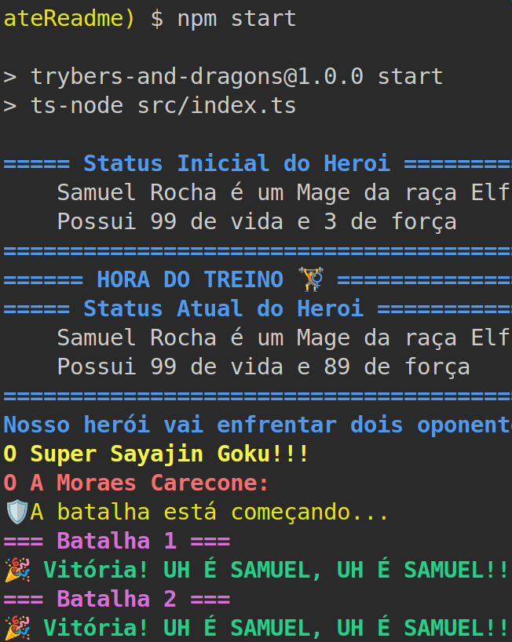
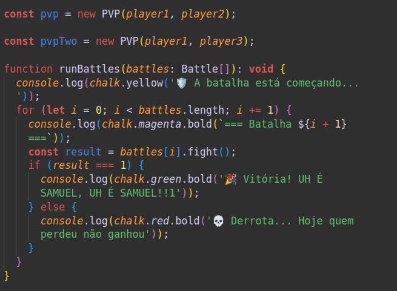

#  Trybers y Dragones


## 🌐 [](https://github.com/SamuelRocha91/trybeAndDragons/blob/main/README.md) [](https://github.com/SamuelRocha91/trybeAndDragons/blob/main/README_es.md) [](https://github.com/SamuelRocha91/trybeAndDragons/blob/main/README_en.md) [](https://github.com/SamuelRocha91/trybeAndDragons/blob/main/README_ru.md) [](https://github.com/SamuelRocha91/trybeAndDragons/blob/main/README_ch.md) [](https://github.com/SamuelRocha91/trybeAndDragons/blob/main/README_ar.md)




## Descripción

**Trybers y Dragones** es una aplicación RPG donde los usuarios pueden crear personajes con varias razas y arquetipos, y generar emocionantes enfrentamientos entre personajes, ya sea en modos Jugador vs. Entorno (PvE) o Jugador vs. Jugador (PvP). Al manipular el archivo `index.ts` y la función `runBattles`, los jugadores pueden crear y desafiar a otros personajes en épicas batallas.

## Características

- **Creación de Personajes**: Elige entre varias razas (como Elfos, Humanos, etc.) y arquetipos para construir tu personaje único.
- **Modos de Conflicto**: Participa en batallas PvE contra criaturas controladas por el sistema o enfréntate a otros jugadores en batallas PvP.
- **Desafíos Personalizados**: Manipula el archivo `index.ts` para ajustar la lógica del juego y la función `runBattles` para crear desafíos personalizados.

## Tecnologías Utilizadas

- **TypeScript**: Para asegurar tipado estático y mejorar la mantenibilidad del código.
- **Programación Orientada a Objetos**: Estructura del código basada en principios de programación orientada a objetos, facilitando la creación y extensión de clases.
- **Docker**: Usado para crear un entorno de desarrollo aislado y reproducible.

## Conceptos Clave Cubiertos

- Programación orientada a objetos;
- Principios SOLID;

## Requisitos Previos

- Node.js (versión recomendada: 16 o 18)
- NPM (generalmente instalado con Node.js)
- Docker (opcional pero recomendado para entornos de desarrollo)

## Instalación

1. Clona el repositorio:

   ```bash
   git clone <REPOSITORY_URL>
   cd trybers-y-dragones
   ```

2. Instala las dependencias:

   ```bash
   npm install
   ```

3. Para ejecutar la aplicación, utiliza el comando:

   ```bash
   npm start
   ```

   Esto iniciará la aplicación y ejecutará el archivo `index.ts`.

## Cómo Manipular el Juego

1. **Modificar el Archivo `index.ts`**: 
   - Este archivo es el punto de entrada de la aplicación. Puedes agregar nuevas características o alterar las existentes.
   - La función `runBattles` es responsable de gestionar los enfrentamientos. ¡Siéntete libre de adaptarla a tus necesidades!

2. **Creación de Personajes**:
   - Usa las clases disponibles para crear personajes con diferentes rasgos.
   - Explora las opciones de raza y arquetipo para personalizar tu personaje.

3. **Desafíos**:
   - Prueba las batallas PvE y PvP, ajustando los parámetros en la función `runBattles` para crear diferentes escenarios de combate.

## Otros Proyectos

- ⚽ [API de Fútbol en TypeScript](https://github.com/SamuelRocha91/trybeFutebolClube/blob/main/README_es.md)
- 🌶️ [Aplicación de Recetas](https://github.com/SamuelRocha91/ProjectRecipesApp/blob/main/README_es.md)
- 🐣 [Pokedex](https://github.com/SamuelRocha91/pokedex/blob/main/README_es.md)
- 🏪 [Tienda Online FrontEnd](https://github.com/SamuelRocha91/project-frontend-online-store/blob/main/README_es.md)
- 👛 [Organizador de Gastos](https://github.com/SamuelRocha91/project-trybewallet/blob/main/README_es.md)
- 🎮 [Trivia](https://github.com/SamuelRocha91/trivia_game/blob/main/README_es.md)
- 🗡️ [Trybe Smith](https://github.com/SamuelRocha91/TrybeSmith/blob/main/README_es.md)
- 🪧 [API de Blogs](https://github.com/SamuelRocha91/BlogsApi/blob/main/README_es.md)
